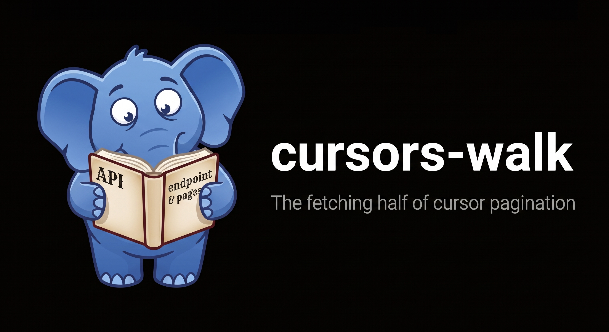

# cursor-walk



**The fetching half of cursor pagination for PHP.**

You implement one method, `fetchPage(?string $cursor): Page`, that turns one upstream response into
one page. cursor-walk owns the loop around it: threading the cursor, fetching each page only when
iteration reaches it, resuming from a checkpoint, stopping runaway upstreams, and cutting exact-N
slices for a Relay `first`. It works against a REST API, a GraphQL API, a DynamoDB scan, or
anything else that says "here is a page, here is the cursor for the next one".

[](https://github.com/ryckakas/cursor-walk/actions/workflows/ci.yml)
[](https://packagist.org/packages/ryckakas/cursor-walk)
[](https://packagist.org/packages/ryckakas/cursor-walk)
[](https://phpstan.org/)
[](LICENSE)

## Why this one

- **Lazy by construction.** One upstream call per page, made when iteration crosses into it. A
  client asking for 25 items from 100-item pages costs one call, not the whole dataset in memory.
- **Guarded by default.** A repeated cursor throws. An upstream that hands out fresh cursors forever
  hits a page budget, and the exception carries the cursor to resume from.
- **Resumable.** Every `endCursor` is a checkpoint, so a batch job that dies halfway picks up at
  the page it was on.
- **Exact slices.** `slice()` assembles exactly `first` items across as many fetches as it takes,
  even when the end lands in the middle of an upstream page.
- **Relay output with no GraphQL dependency.** `ConnectionFormatter` returns a plain `edges` /
  `pageInfo` array that a resolver can return as is.
- **Any cursor, any transport.** Opaque tokens, page numbers and row offsets all work, because the
  engine never looks inside a cursor. The library makes no requests of its own, and `require` is
  `php` alone.

## Install

```bash
composer require ryckakas/cursor-walk
```

PHP 8.2 or newer. No runtime dependencies.

## Use it

Implement `PaginatedFetcher`, the only integration point: one upstream response in, one `Page` out.

```php
use CursorWalk\Page;
use CursorWalk\PaginatedFetcher;
use CursorWalk\Paginator;

/** @implements PaginatedFetcher<array{id: int, name: string}> */
final class WidgetFetcher implements PaginatedFetcher
{
    public function __construct(private readonly WidgetApi $api) // your HTTP client, SDK, anything
    {
    }

    public function fetchPage(?string $cursor): Page
    {
        $response = $this->api->listWidgets(limit: 100, after: $cursor);

        return new Page($response['data'], $response['next_cursor'] ?? null, $response['has_more']);
    }
}

$paginator = new Paginator();

foreach ($paginator->items(new WidgetFetcher($api)) as $widget) {
    // Page 2 is fetched when the loop reaches item 101, not before.
}
```

<details>
<summary><b>The same fetcher over a PSR-18 client, validating the envelope</b></summary>

```php
use CursorWalk\Exception\MalformedPageException;
use CursorWalk\Page;
use CursorWalk\PaginatedFetcher;
use Psr\Http\Client\ClientInterface;
use Psr\Http\Message\RequestFactoryInterface;

/** @implements PaginatedFetcher<array{id: int, name: string}> */
final class WidgetFetcher implements PaginatedFetcher
{
    public function __construct(
        private readonly ClientInterface $http,
        private readonly RequestFactoryInterface $requests,
    ) {
    }

    public function fetchPage(?string $cursor): Page
    {
        $url = 'https://api.example.com/widgets?limit=100'
            . ($cursor === null ? '' : '&after=' . urlencode($cursor));

        $body = (string) $this->http->sendRequest($this->requests->createRequest('GET', $url))->getBody();
        $data = json_decode($body, true);
        if (!is_array($data) || !isset($data['data']) || !is_array($data['data'])) {
            throw MalformedPageException::invalidEnvelope('missing "data" key', $cursor, $body);
        }

        return new Page(
            items: array_values($data['data']),
            endCursor: $data['next_cursor'] ?? null,
            hasNextPage: (bool) ($data['has_more'] ?? false),
            totalCount: $data['total'] ?? null,
        );
    }
}
```

Snippets omit `declare(strict_types=1);`. The library declares it in every file, and your
fetchers should too.

</details>

`Paginator` is stateless: inject one and reuse it. It has three methods.

| Method | Returns | Use it for |
| --- | --- | --- |
| `items($fetcher, ?string $pageCursor = null, int $skip = 0)` | `Generator<int, T>` | Streaming every item. |
| `pages($fetcher, ?string $startCursor = null)` | `Generator<int, Page<T>>` | Batch jobs: one transaction, retry and checkpoint per page. |
| `slice($fetcher, int $first, ?string $pageCursor = null, int $skip = 0)` | `Page<T>` | Exactly N items, such as a Relay `first`. |

<details>
<summary><b>The page budget</b></summary>

`new Paginator()` stops after 10,000 pages and throws `PageBudgetExceededException`, whose
`getLastCursor()` resumes the walk. Loop detection catches a cursor that repeats, but not an
upstream that returns a fresh cursor with `hasNextPage: true` forever. The budget does. Size it to
the caller, not the dataset:

```php
$interactive = new Paginator(maxPages: 50);      // an API request: fail fast
$batch       = new Paginator(maxPages: 100_000); // a nightly sync: still bounded
$unbounded   = new Paginator(maxPages: null);    // no limit, and the risk is yours
```

Why the budget is on by default, and what `null` costs, is in
[the design notes](docs/design.md#the-guards-bug-versus-policy).

</details>

<details>
<summary><b>When a walk fails</b></summary>

| Exception | Meaning | Typical response |
| --- | --- | --- |
| `MalformedPageException` | The upstream response is not a usable page. | Log `getCursor()` and `getRawContext()`; retry or fail the request. |
| `PaginationLoopException` | A cursor repeated, so the walk would never end. | A bug upstream or in the fetcher. Do not retry. |
| `PageBudgetExceededException` | Your `maxPages` was reached. | Resume from `getLastCursor()`, or raise the budget. |

All three extend `CursorWalk\Exception\CursorWalkException`, a `\RuntimeException`. `Page` itself
throws `MalformedPageException` for the one combination it refuses: `hasNextPage: true` with no
`endCursor`. Anything stricter belongs in your fetcher; see
[rejecting malformed pages](docs/recipes.md#rejecting-malformed-pages).

</details>

## Recipes

- [**A GraphQL resolver returning a Relay connection**](docs/recipes.md#a-graphql-resolver-returning-a-relay-connection):
  `slice()` and `ConnectionFormatter`, with edge cursors that round-trip as `after`.
- [**Batch jobs that checkpoint per page**](docs/recipes.md#batch-jobs-checkpoint-per-page):
  `pages()` as the transaction and retry boundary.
- [**Resuming a walk**](docs/recipes.md#resuming-a-walk): from a checkpoint, a client's cursor, or
  an exhausted page budget.
- [**Page-numbered and offset upstreams**](docs/recipes.md#page-numbered-and-offset-upstreams):
  `?page=2` and `?offset=100` APIs through `PageNumberFetcher` and `OffsetFetcher`.
- [**Driving the walk yourself**](docs/recipes.md#driving-the-walk-yourself): `Walk`, for Temporal
  workflows and event loops that cannot let the library call `fetchPage()`.
- [**Rejecting malformed pages**](docs/recipes.md#rejecting-malformed-pages): stricter upstream
  policy in the fetcher, and catching each failure separately.

> [!IMPORTANT]
> The default Relay edge cursor names a position, not an item, so it can repeat or skip rows if the
> upstream changes between requests. Read [cursor stability](docs/design.md#cursor-stability)
> before storing one.

## Documentation

- [Recipes](docs/recipes.md): the patterns above, in full
- [Design notes](docs/design.md): the guards, cursor stability, what it deliberately does not do,
  and how it fits with webonyx/graphql-php, graphql-relay-php and relay-pagination
- [Roadmap](ROADMAP.md): what is likely to come next, and why
- [Changelog](CHANGELOG.md): what changed in each release

## Development

<details>
<summary><b>Commands and gates</b></summary>

```bash
composer check      # code style, static analysis, complexity, tests, offline example
composer check:ci   # everything CI runs, adding the coverage and mutation floors
```

`check:ci` needs xdebug or pcov. The complexity gate is
[bonsai-lint](https://bonsai.kauneckas.dev), run through `npx`, so it needs Node. CI also audits
the workflows with [zizmor](https://docs.zizmor.sh). [AGENTS.md](AGENTS.md) has the conventions.

</details>

## License

MIT. See [LICENSE](LICENSE).
